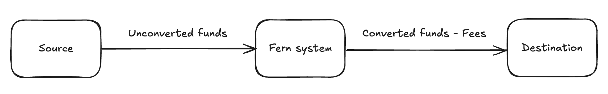

# Transaction fees

Fern enables developers to earn fees from each conversion transaction. Fees are deducted from the receiving amount before being sent to the destination account. The total transaction fee that is deducted includes:

* Your developer fee (if any)
* Fern conversion fee
* Fiat payment method fee (if any)
* Gas reimbursement fee

<figure><figcaption></figcaption></figure>

### Your developer fee

When creating [Quotes](../api-reference/quotes.md) for your customer's transaction, you can also include a developer fee to charge additional to the Fern fees. Fern will deduct these fees for you, and remit the aggregated sum to you on a monthly basis.

### Fern conversion fee

Fern conversion fees vary based on the currency pair. You can get estimated Fern fees for a route by submitting a [Quote](../api-reference/quotes.md).

### Fiat payment method fee

If a transaction is settling on fiat payment rails (e.g. offramps), Fern charges a fiat payment method fee. These fees vary by fiat currency and payment method, and can be retrieved via [Quotes](../api-reference/quotes.md).

### Gas reimbursement fee

Fern charges gas fees for transactions on Ethereum mainnet, and reserves the right to charge gas reimbursements on other networks.
